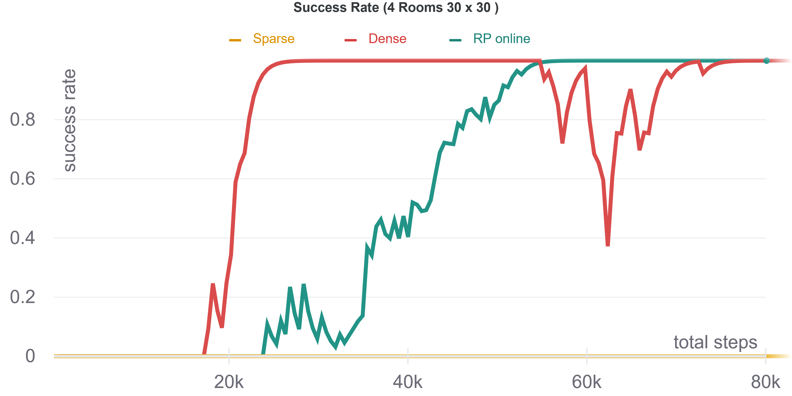
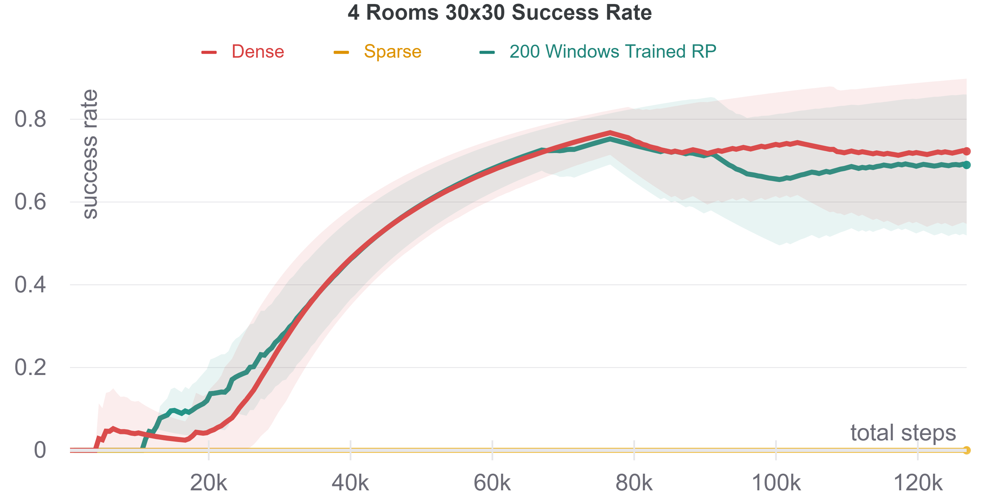
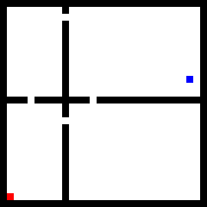
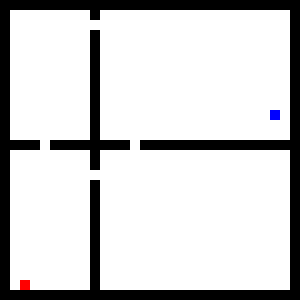

# RL With Trajectory Feedback
## Documentation

### Abstract
For many RL problems an informative reward function can improve the learning process of a sparse reward environment, though it can be much harder to define.
RL With Trajectory Feedback is an addon for regular RL problems, which enables to use an observer feedback on agent's 
performance to learn an informative reward function. 
First, we showed that an informative reward function (per state, action pair) can be learned using a sequence reward function, which was represented by labeled sequences. 

In addition, we showed that by using merely 200 user labeled short sequences, we could learn a reward function that brings unsolvable sparse-reward environment to converge.

### Project Book
The full project book can be found in: 
[Project Book](doc/RL_Project_Book.pdf)


## Get Started

### Requirements
1. python 3.7 (or newer)
2. python3.7-tk (or newer) For GUI features (e.g. show windows for train online)
3. install requirements:
```
    pip install -r requirements.txt
```
### Using the code

#### Random Rooms
The main script for experiments on rooms environment is `scripts/run_rooms.py`. 
The environment is implemented in `src/envs/random_rooms.py`

For further information on all flags of this scripts run the following command:
```
python scripts/run_rooms.py --help
```


## Examples

1. Train with sparse reward:
```
python scripts/run_rooms.py --config examples/rooms/sparse.yaml
```
2. Train with dense reward:
```
python scripts/run_rooms.py --config examples/rooms/dense.yaml
```
3. Train with Online RP training, using "Perfect User" reward:
```
python scripts/run_rooms.py --config examples/rooms/perfect_user.yaml
```
4. Train with Online RP training, using "Discrete User" (with Noise) reward:
```
python scripts/run_rooms.py --config examples/rooms/discrete_user.yaml
```   


## Results

### Online Perfect Reward Predictor
As mentioned in the Project books, one of the experiments was to compare pure sparse reward environment Vs Online Reward Predictor that was trained with accumulated dense reward Online:


#### Reward Predictor Training
In the following graph we can see that the Reward Predictor converged during the agent training





When we reachd the **Manual experiment**,  we have labled 200 windows, and trained the RP with them **Offline**.
Then we loaded the pre-trained RP at the begining of the agent RL training and used it as the intrinsic reward.
The following graph shows the success rate of this agent Vs the baseline:




#### Agent Peformance (Sparse Vs Perfect User RP)

Sparse Reward environment:



Sparse Reward Environment + "Perfect User" Online trained RP:




Sparse Reward Environment + "Discrete User" (+ noise) Online trained RP:


## Authors

RL with trajectory feedback was designed by [Uri Gadot](https://github.com/Ugadot) and [Hagay Michaeli](https://github.com/hmichaeli)


